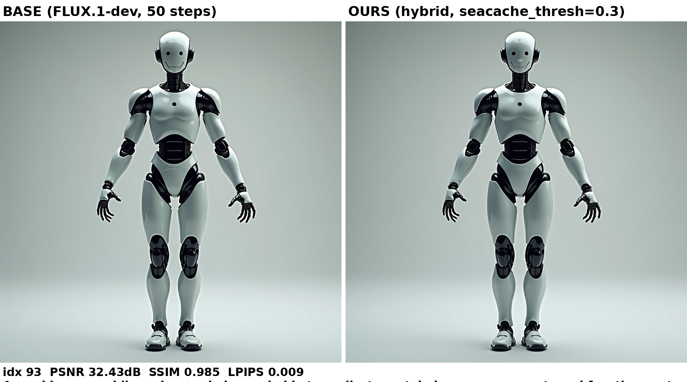
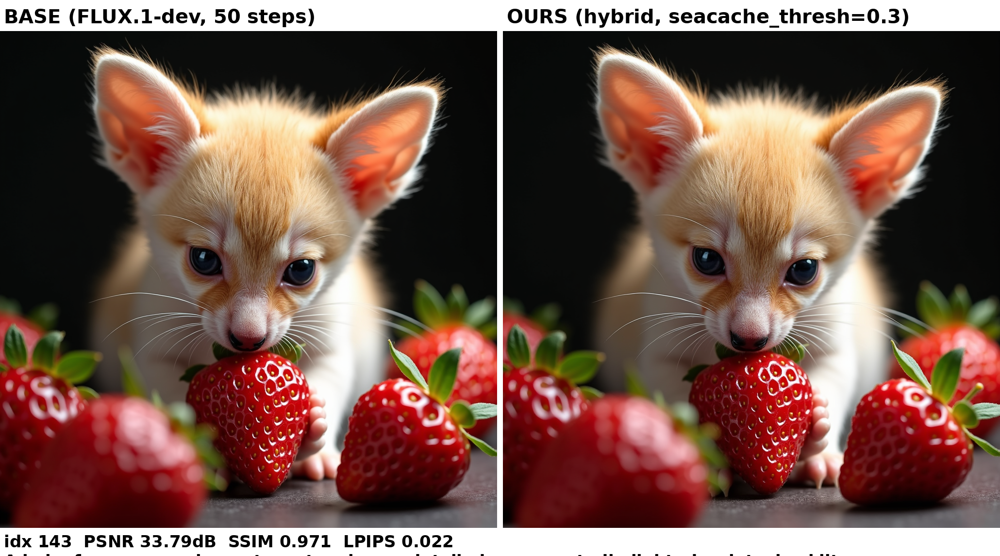
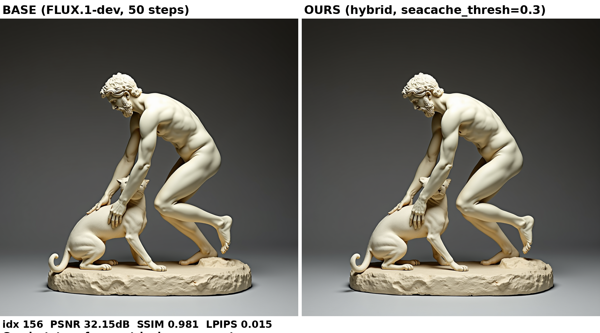

# ReSPect: Residual Spectral Prediction for Efficient Caching of Transformers

Training-free diffusion cache: **SeaCache's** spectral-evolution (SEA) skip
schedule + **Spectrum-style** residual forecasting instead of residual reuse.
On skipped steps we forecast the transformer residual (Chebyshev ridge `M=4`,
`λ=0.1`, blended `w=0.5` with a discrete Taylor step, warm-up `min_cheb_obs=4`)
rather than copying the last cached residual.

Upstreams (not vendored here): [SeaCache](https://github.com/jiwoogit/SeaCache)
(CVPR 2026 Oral), [Spectrum](https://github.com/hanjq17/Spectrum) (CVPR 2026).

## Supported models

| Model | Patch | Eval |
|---|---|---|
| FLUX.1-dev 1024×1024 | `seacache_spectrum/src/flux/` | `scripts/eval_flux.py` + `prompts/drawbench200.txt` |
| Wan2.1-1.3B 480p×65f | `seacache_spectrum/src/wan/` | `scripts/eval_video.py` + `prompts/vbench946.txt` |
| HunyuanVideo 480p×65f | `seacache_spectrum/src/hunyuan/` (diffusers path) | `scripts/eval_video.py` |

Core (shared): `src/common/` (SEA filter + forecaster).
Method note: [`seacache_spectrum/research.md`](seacache_spectrum/research.md).
Paper: [`paper.pdf`](paper.pdf) (compiled; source kept outside the repo).

## Setup

```bash
cd seacache_spectrum
uv venv .venv && uv pip install --python .venv/bin/python -r requirements.txt
# FLUX.1-dev is gated — log in first:
.venv/bin/huggingface-cli login
```

## Inference

```python
import sys; sys.path.insert(0, "seacache_spectrum/src")
from flux.flux_forward import cached_flux_forward, reset_cache_state
pipe = DiffusionPipeline.from_pretrained("black-forest-labs/FLUX.1-dev",
                                         torch_dtype=torch.bfloat16).to("cuda")
pipe.transformer.__class__.forward = cached_flux_forward
reset_cache_state(pipe.transformer, num_steps=50, mode="hybrid", args)  # or "base"/"seacache"
```

## Eval (quality vs uncached base, same seed)

```bash
cd seacache_spectrum
# FLUX, 4-prompt smoke
.venv/bin/python scripts/eval_flux.py --num_prompts 4 --seacache_thresh 0.3 --output_dir ./outputs
# FLUX, DrawBench-200
.venv/bin/python scripts/eval_flux.py --prompt_file prompts/drawbench200.txt \
  --num_prompts 200 --seacache_thresh 0.3 --output_dir ./outputs_hybrid_d03
.venv/bin/python scripts/compute_metrics.py --base_dir ./outputs_base --hybrid_dir ./outputs_hybrid_d03
# Wan2.1 (see seacache_spectrum/README.md for resume/reuse flags)
.venv/bin/python scripts/eval_video.py --model wan --modes base hybrid \
  --prompt_file prompts/vbench946.txt --num_prompts 20 --seacache_thresh 0.2 \
  --save_base_frames --compile --attn cudnn --output_dir ./outputs_video_wan_d02
```

## Results (ours, B200; baselines SeaCache-published at matched TFLOPs)

FLUX.1-dev DrawBench-200: δ0.3 → **27.97 dB** (+1.68) @1241 TFLOPs;
δ0.6 → **21.63 dB** (+0.30) @774 TFLOPs. Wan2.1-1.3B VBench-946:
δ0.2 → **28.38 dB** (+1.78), SSIM 0.905, LPIPS 0.066 @4303 TFLOPs;
δ0.35 → **26.70 dB** (+4.92), SSIM 0.884, LPIPS 0.084 @3336 TFLOPs.
Paper: [`paper.pdf`](paper.pdf). Full per-prompt metrics:
[`seacache_spectrum/results/`](seacache_spectrum/results/).

### FLUX examples (base left vs ReSPect right, δ0.3)

| Prompt | Base vs ReSPect |
|---|---|
| Robot (#93) |  |
| Fennec fox (#143) |  |
| Statue (#156) |  |

### Wan2.1 examples (base vs ReSPect δ0.35, 480×832×65f)

| Prompt | Base | ReSPect (δ=0.35) |
|---|---|---|
| Ocean swim | <video src="seacache_spectrum/examples_video/0834-ocean_base.mp4" width="360" controls></video> | <video src="seacache_spectrum/examples_video/0834-ocean_hybrid.mp4" width="360" controls></video> |
| Pool splash | <video src="seacache_spectrum/examples_video/0852-indoor_swimming_pool_base.mp4" width="360" controls></video> | <video src="seacache_spectrum/examples_video/0852-indoor_swimming_pool_hybrid.mp4" width="360" controls></video> |
| Waterfall | <video src="seacache_spectrum/examples_video/0860-waterfall_base.mp4" width="360" controls></video> | <video src="seacache_spectrum/examples_video/0860-waterfall_hybrid.mp4" width="360" controls></video> |
